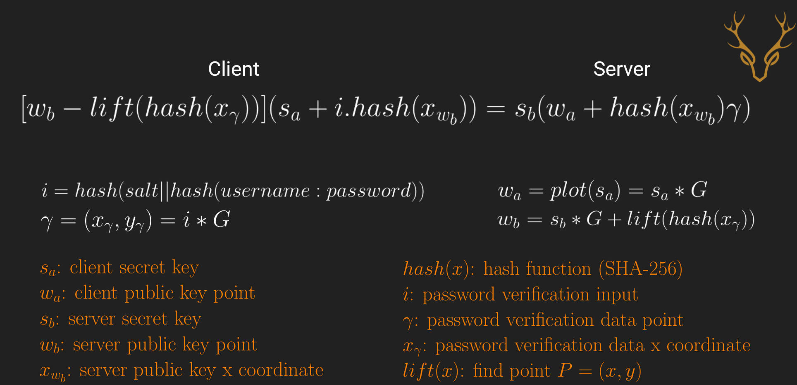

# EC-SRP
An elliptic curve implementation of Secure Remote Protocol (SRP) written in Python.

# Description
This repo contains a server and client implementation of the Elliptic Curve Secure Remote Protocol (EC-SRP) key sharing and authentication protocol. Inspired by [this IEEE submission draft](https://web.archive.org/web/20131228182531/http://grouper.ieee.org/groups/1363/passwdPK/submissions/p1363ecsrp.pdf). 

# Related Work
This implementation is similar to, but not exactly the same as, MikroTik's EC-SRP5 implementation used for its Winbox and MAC Telnet services. For more on those services, please review our blog post ["MikroTik Authentication Revealed"](https://margin.re/blog/mikrotik-authentication-revealed.aspx) which highlights the overall protocol and our [MikroTik Authentication Repo](https://github.com/MarginResearch/mikrotik_authentication) which implements both clients and server services.

# Technical Details
The EC-SRP algorithm can be distilled into the following client and server calculations: 



This repo primarily uses Jacobian points in projective space as oppose to the affine Weierstrass form. 

# Usage
The client and server can connect to each other over a host's loopback address using the following commands: 

```
server: python3 ecsrp_server.py -a 127.0.0.1 -u admin -p pass
client: python3 ecsrp_client.py -a 127.0.0.1 -u admin -p pass
```

# Dependencies
These tools require the `ecdsa` library:

```
pip3 install ecdsa
```
